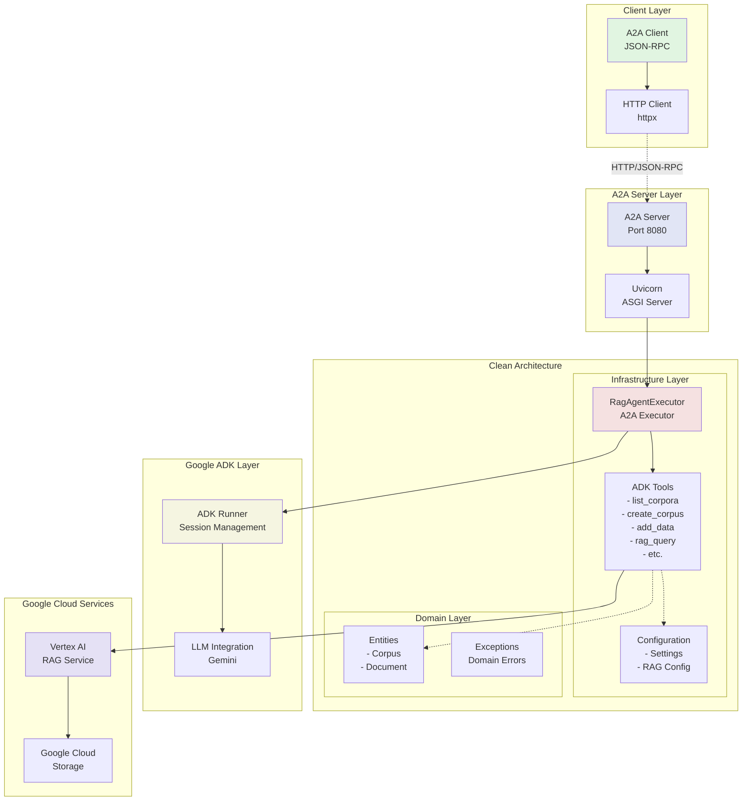
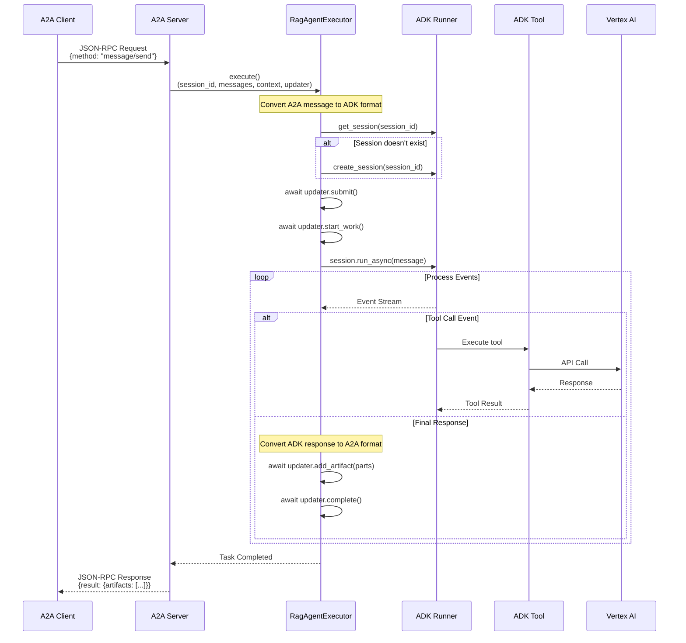

# Vertex AI RAG Agent with ADK

This repository contains a Google Agent Development Kit (ADK) implementation of a Retrieval Augmented Generation (RAG) agent using Google Cloud Vertex AI, exposed via the A2A (Agent-to-Agent) protocol with Clean Architecture.

## Architecture

### Component Diagram



### Sequence Diagram - Message Processing



## Overview

The Vertex AI RAG Agent allows you to:

- Query document corpora with natural language questions
- List available document corpora
- Create new document corpora
- Add new documents to existing corpora
- Get detailed information about specific corpora
- Delete corpora when they're no longer needed

## Project Structure

```
adk-rag-agent/
├── app/                        # Main application code
│   ├── domain/                 # Domain layer (entities, exceptions)
│   ├── infrastructure/         # Infrastructure layer
│   │   ├── tools/             # ADK tools implementation
│   │   ├── web/               # A2A executor and web components
│   │   └── config/            # Configuration files
│   └── main/                  # Entry points
│       └── a2a_main.py        # A2A server
├── docs/                      # Documentation
│   ├── ADK_A2A_CLEAN_ARCHITECTURE_GUIDE.md
│   ├── MIGRATION_GUIDE_ADK_TO_A2A.md
│   ├── TROUBLESHOOTING_A2A_ADK.md
│   └── WORKING_EXAMPLE_ADK_A2A.md
├── examples/                  # Example implementations
├── a2a_client.py             # A2A client implementation
├── requirements.txt          # Python dependencies
└── .env.example             # Environment variables template
```

## Prerequisites

- A Google Cloud account with billing enabled
- A Google Cloud project with the Vertex AI API enabled
- Appropriate access to create and manage Vertex AI resources
- Python 3.9+ environment

## Setting Up Google Cloud Authentication

Before running the agent, you need to set up authentication with Google Cloud:

1. **Install Google Cloud CLI**:
   - Visit [Google Cloud SDK](https://cloud.google.com/sdk/docs/install) for installation instructions for your OS

2. **Initialize the Google Cloud CLI**:
   ```bash
   gcloud init
   ```
   This will guide you through logging in and selecting your project.

3. **Set up Application Default Credentials**:
   ```bash
   gcloud auth application-default login
   ```
   This will open a browser window for authentication and store credentials in:
   `~/.config/gcloud/application_default_credentials.json`

4. **Verify Authentication**:
   ```bash
   gcloud auth list
   gcloud config list
   ```

5. **Enable Required APIs** (if not already enabled):
   ```bash
   gcloud services enable aiplatform.googleapis.com
   ```

## Installation

1. **Clone the repository**:
   ```bash
   git clone git@github.com:einsteindark-edgm/adk-rag-agent.git
   cd adk-rag-agent
   ```

2. **Set up a virtual environment**:
   ```bash
   python -m venv .venv
   source .venv/bin/activate  # On Windows: .venv\Scripts\activate
   ```

3. **Install Dependencies**:
   ```bash
   pip install -r requirements.txt
   ```

4. **Configure Environment**:
   ```bash
   cp .env.example .env
   # Edit .env with your Google Cloud project details
   ```

## Running the Agent

### Start the A2A Server

```bash
python -m app.main.a2a_main
```

The server will start on `http://localhost:8080`

### Using the A2A Client

```bash
# Interactive mode
python a2a_client.py

# Test mode
python a2a_client.py --test
```

### Example Client Usage

```python
from a2a_client import RAGAgentClient
import asyncio

async def main():
    client = RAGAgentClient()
    await client.connect()
    
    # List corpora
    response = await client.send_message("List all available corpora")
    print(response)
    
    # Create a corpus
    response = await client.send_message("Create a new corpus called 'my-docs'")
    print(response)
    
    # Add documents
    response = await client.send_message(
        "Add data to my-docs from ['https://drive.google.com/file/d/YOUR_FILE_ID/view']"
    )
    print(response)
    
    # Query documents
    response = await client.send_message("Query my-docs for information about AI")
    print(response)
    
    await client.close()

asyncio.run(main())
```

## Using the Agent

The agent provides the following functionality through its tools:

### 1. Query Documents
Allows you to ask questions and get answers from your document corpus:
- Automatically retrieves relevant information from the specified corpus
- Generates informative responses based on the retrieved content

### 2. List Corpora
Shows all available document corpora in your project:
- Displays corpus names and basic information
- Helps you understand what data collections are available

### 3. Create Corpus
Create a new empty document corpus:
- Specify a custom name for your corpus
- Sets up the corpus with recommended embedding model configuration
- Prepares the corpus for document ingestion

### 4. Add New Data
Add documents to existing corpora or create new ones:
- Supports Google Drive URLs and GCS (Google Cloud Storage) paths
- Automatically creates new corpora if they don't exist

### 5. Get Corpus Information
Provides detailed information about a specific corpus:
- Shows document count, file metadata, and creation time
- Useful for understanding corpus contents and structure

### 6. Delete Corpus
Removes corpora that are no longer needed:
- Requires confirmation to prevent accidental deletion
- Permanently removes the corpus and all associated files

## Troubleshooting

If you encounter issues:

- **Authentication Problems**:
  - Run `gcloud auth application-default login` again
  - Check if your service account has the necessary permissions

- **API Errors**:
  - Ensure the Vertex AI API is enabled: `gcloud services enable aiplatform.googleapis.com`
  - Verify your project has billing enabled

- **Quota Issues**:
  - Check your Google Cloud Console for any quota limitations
  - Request quota increases if needed

- **Missing Dependencies**:
  - Ensure all requirements are installed: `pip install -r requirements.txt`

## Quick Start Example

```bash
# Terminal 1 - Start the server
python -m app.main.a2a_main

# Terminal 2 - Run test queries
python -c "
import asyncio
from a2a_client import RAGAgentClient

async def test():
    client = RAGAgentClient()
    await client.connect()
    
    # List existing corpora
    print(await client.send_message('List all corpora'))
    
    # Create a test corpus
    print(await client.send_message('Create a corpus called test-docs'))
    
    # Query (will return no results for empty corpus)
    print(await client.send_message('Query test-docs about AI'))
    
    await client.close()

asyncio.run(test())
"
```

## Documentation

Comprehensive documentation is available in the `docs/` directory:

- **[ADK + A2A + Clean Architecture Guide](docs/ADK_A2A_CLEAN_ARCHITECTURE_GUIDE.md)** - Complete integration guide
- **[Migration Guide](docs/MIGRATION_GUIDE_ADK_TO_A2A.md)** - Migrate existing ADK agents to A2A
- **[Troubleshooting Guide](docs/TROUBLESHOOTING_A2A_ADK.md)** - Common issues and solutions
- **[Working Example](docs/WORKING_EXAMPLE_ADK_A2A.md)** - Full working implementation
- **[Quick Reference](docs/ADK_A2A_QUICK_REFERENCE.md)** - Quick lookup for common patterns

## Additional Resources

- [Vertex AI RAG Documentation](https://cloud.google.com/vertex-ai/generative-ai/docs/rag-overview)
- [Google Agent Development Kit (ADK) Documentation](https://github.com/google/agents-framework)
- [Google Cloud Authentication Guide](https://cloud.google.com/docs/authentication)
- [A2A Protocol Specification](https://github.com/GoogleCloudPlatform/generative-ai/tree/main/a2a)

## License

This project is licensed under the Apache License 2.0 - see the LICENSE file for details.

## Contributing

Contributions are welcome! Please read the contributing guidelines before submitting pull requests.

## Support

For issues and questions:
- Check the [Troubleshooting Guide](docs/TROUBLESHOOTING_A2A_ADK.md)
- Review the [documentation](docs/)
- Open an issue on GitHub
