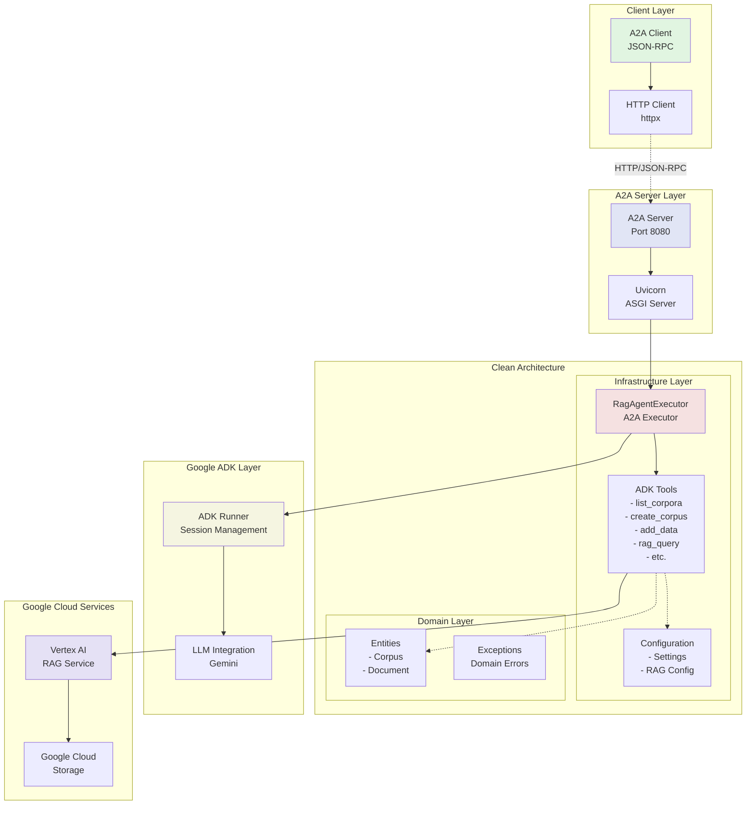
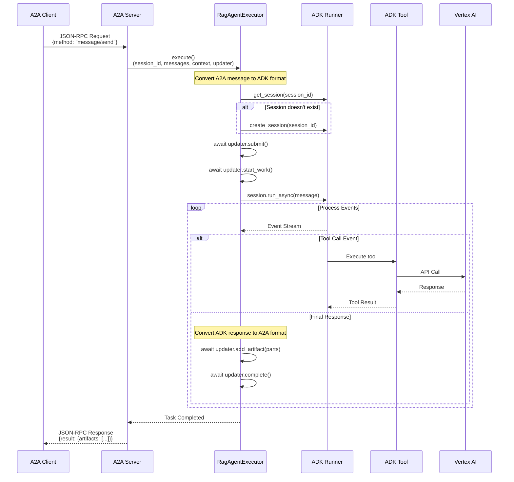
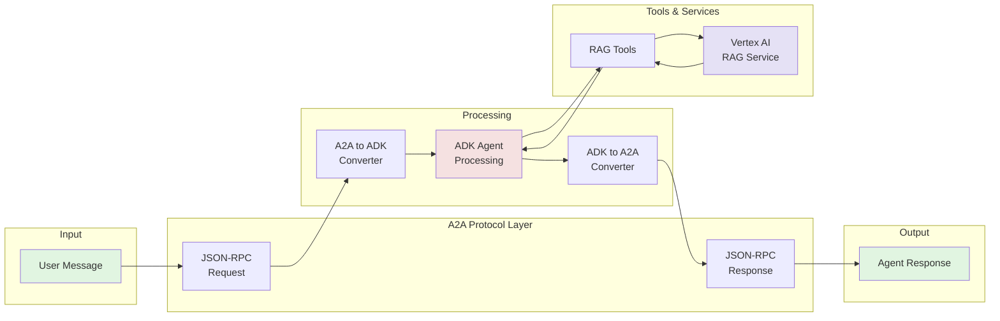
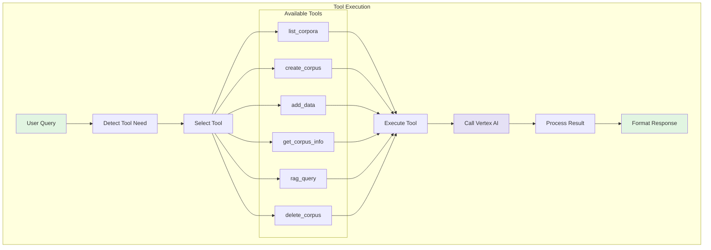

# Architecture Diagrams

## Component Diagram

```mermaid
graph TB
    subgraph "Client Layer"
        A2AC[A2A Client<br/>JSON-RPC]
        HTTPC[HTTP Client<br/>httpx]
    end
    
    subgraph "A2A Server Layer"
        A2AS[A2A Server<br/>Port 8080]
        UVIC[Uvicorn<br/>ASGI Server]
    end
    
    subgraph "Clean Architecture"
        subgraph "Infrastructure Layer"
            EXE[RagAgentExecutor<br/>A2A Executor]
            TOOLS[ADK Tools<br/>- list_corpora<br/>- create_corpus<br/>- add_data<br/>- rag_query<br/>- etc.]
            CONFIG[Configuration<br/>- Settings<br/>- RAG Config]
        end
        
        subgraph "Domain Layer"
            ENT[Entities<br/>- Corpus<br/>- Document]
            EXC[Exceptions<br/>Domain Errors]
        end
    end
    
    subgraph "Google ADK Layer"
        RUNNER[ADK Runner<br/>Session Management]
        LLM[LLM Integration<br/>Gemini]
    end
    
    subgraph "Google Cloud Services"
        VAI[Vertex AI<br/>RAG Service]
        GCS[Google Cloud<br/>Storage]
    end
    
    A2AC --> HTTPC
    HTTPC -.->|HTTP/JSON-RPC| A2AS
    A2AS --> UVIC
    UVIC --> EXE
    EXE --> RUNNER
    EXE --> TOOLS
    RUNNER --> LLM
    TOOLS --> VAI
    VAI --> GCS
    TOOLS -.-> CONFIG
    TOOLS -.-> ENT
    
    style A2AC fill:#e1f5e1
    style A2AS fill:#e1e5f5
    style EXE fill:#f5e1e1
    style RUNNER fill:#f5f5e1
    style VAI fill:#e5e1f5
```

## Sequence Diagram - Message Processing

```mermaid
sequenceDiagram
    participant Client as A2A Client
    participant Server as A2A Server
    participant Executor as RagAgentExecutor
    participant Runner as ADK Runner
    participant Tool as ADK Tool
    participant VAI as Vertex AI

    Client->>Server: JSON-RPC Request<br/>{method: "message/send"}
    Server->>Executor: execute()<br/>(session_id, messages, context, updater)
    
    Note over Executor: Convert A2A message to ADK format
    
    Executor->>Runner: get_session(session_id)
    alt Session doesn't exist
        Executor->>Runner: create_session(session_id)
    end
    
    Executor->>Executor: await updater.submit()
    Executor->>Executor: await updater.start_work()
    
    Executor->>Runner: session.run_async(message)
    
    loop Process Events
        Runner-->>Executor: Event Stream
        alt Tool Call Event
            Runner->>Tool: Execute tool
            Tool->>VAI: API Call
            VAI-->>Tool: Response
            Tool-->>Runner: Tool Result
        else Final Response
            Note over Executor: Convert ADK response to A2A format
            Executor->>Executor: await updater.add_artifact(parts)
            Executor->>Executor: await updater.complete()
        end
    end
    
    Executor-->>Server: Task Completed
    Server-->>Client: JSON-RPC Response<br/>{result: {artifacts: [...]}}
```

## Data Flow Diagram

```mermaid
graph LR
    subgraph "Input"
        USR[User Message]
    end
    
    subgraph "A2A Protocol Layer"
        REQ[JSON-RPC<br/>Request]
        RESP[JSON-RPC<br/>Response]
    end
    
    subgraph "Processing"
        CONV1[A2A to ADK<br/>Converter]
        ADK[ADK Agent<br/>Processing]
        CONV2[ADK to A2A<br/>Converter]
    end
    
    subgraph "Tools & Services"
        TOOLS[RAG Tools]
        VAI[Vertex AI<br/>RAG Service]
    end
    
    subgraph "Output"
        RES[Agent Response]
    end
    
    USR --> REQ
    REQ --> CONV1
    CONV1 --> ADK
    ADK --> TOOLS
    TOOLS --> VAI
    VAI --> TOOLS
    TOOLS --> ADK
    ADK --> CONV2
    CONV2 --> RESP
    RESP --> RES
    
    style USR fill:#e1f5e1
    style RES fill:#e1f5e1
    style ADK fill:#f5e1e1
    style VAI fill:#e5e1f5
```

## Tool Execution Flow

```mermaid
graph TD
    subgraph "Tool Execution"
        START[User Query]
        DETECT[Detect Tool Need]
        SELECT[Select Tool]
        
        subgraph "Available Tools"
            T1[list_corpora]
            T2[create_corpus]
            T3[add_data]
            T4[get_corpus_info]
            T5[rag_query]
            T6[delete_corpus]
        end
        
        EXEC[Execute Tool]
        VAI[Call Vertex AI]
        RESULT[Process Result]
        RESPONSE[Format Response]
    end
    
    START --> DETECT
    DETECT --> SELECT
    SELECT --> T1
    SELECT --> T2
    SELECT --> T3
    SELECT --> T4
    SELECT --> T5
    SELECT --> T6
    T1 --> EXEC
    T2 --> EXEC
    T3 --> EXEC
    T4 --> EXEC
    T5 --> EXEC
    T6 --> EXEC
    EXEC --> VAI
    VAI --> RESULT
    RESULT --> RESPONSE
    
    style START fill:#e1f5e1
    style RESPONSE fill:#e1f5e1
    style VAI fill:#e5e1f5
```